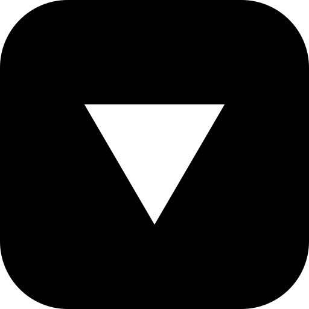

<div align="center">
  

  # @luxfi/logo

  Official Lux logo package providing TypeScript/React components and utilities for consistent branding across the Lux ecosystem.

  [](https://www.npmjs.com/package/@luxfi/logo)
  [](https://opensource.org/licenses/MIT)
  [](https://www.typescriptlang.org/)
</div>

## Logo Showcase

<div align="center">
  <table>
    <tr>
      <th colspan="5">Lux Logo - Multiple Sizes</th>
    </tr>
    <tr>
      <td align="center">
        <br>
        <sub>32�32</sub>
      </td>
      <td align="center">
        <br>
        <sub>64�64</sub>
      </td>
      <td align="center">
        <br>
        <sub>128�128</sub>
      </td>
      <td align="center">
        <br>
        <sub>256�256</sub>
      </td>
      <td align="center">
        <br>
        <sub>512�512</sub>
      </td>
    </tr>
  </table>

  <table>
    <tr>
      <th>macOS Dock Icon</th>
      <th>Monochrome</th>
      <th>Menu Bar Icon</th>
    </tr>
    <tr>
      <td align="center">
        <br>
        <sub>Rounded corners + black background</sub>
      </td>
      <td align="center">
        <br>
        <sub>For single color displays</sub>
      </td>
      <td align="center">
        <br>
        <sub>Solid filled for menu bars</sub>
      </td>
    </tr>
  </table>
</div>

## Features

- =: **Minimalist Triangle Design** - Clean, geometric upside-down triangle logo
- � **React Components** - Ready-to-use React components with TypeScript support
- <� **Multiple Variants** - Color (white), monochrome, and menu bar optimized versions
- =� **Icon Generation** - Generate icons in all required sizes for web and desktop apps
- =� **Platform Icons** - macOS dock icons, menu bar icons, and favicons
- =' **TypeScript Native** - Full TypeScript support with proper type definitions

## Installation

```bash
npm install @luxfi/logo
# or
yarn add @luxfi/logo
# or
pnpm add @luxfi/logo
```

## Quick Start

### React Component

```tsx
import { LuxLogo } from '@luxfi/logo/react';

<LuxLogo size={128} />
<LuxLogo variant="mono" size={64} />
<LuxLogo variant="white" className="w-16 h-16" />
```

### SVG Generation

```ts
import { getColorSVG, getMonoSVG, getWhiteSVG } from '@luxfi/logo';

const colorLogo = getColorSVG();  // White triangle
const monoLogo = getMonoSVG();    // Outlined triangle
const whiteLogo = getWhiteSVG();  // Solid white triangle
```

### Icon Generation

```ts
import { generateIcon, getColorSVGCropped } from '@luxfi/logo';

// Generate macOS dock icon
const svg = getColorSVGCropped();
await generateIcon(svg, 'dock-icon.png', 512, true);
```

## License

MIT � Lux Network

## Support

For issues, questions, or suggestions, visit [GitHub Issues](https://github.com/luxfi/logo/issues)